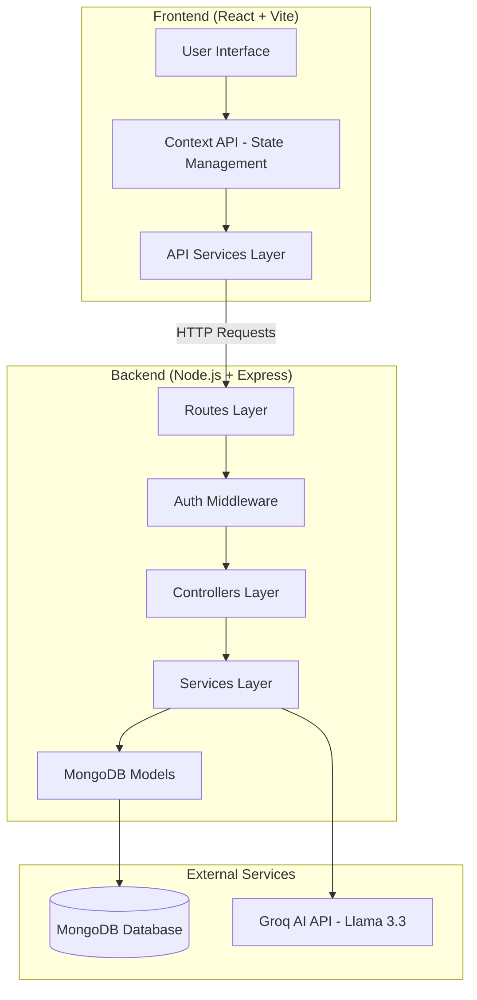
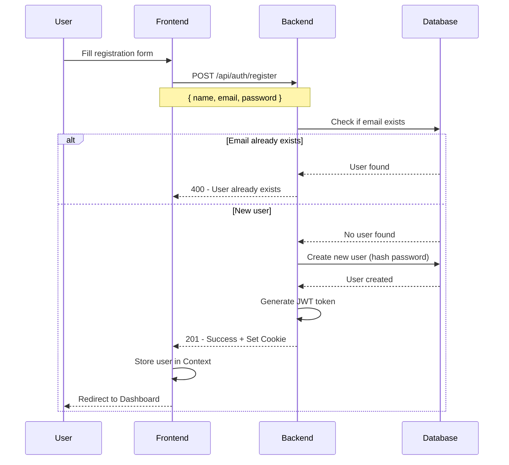
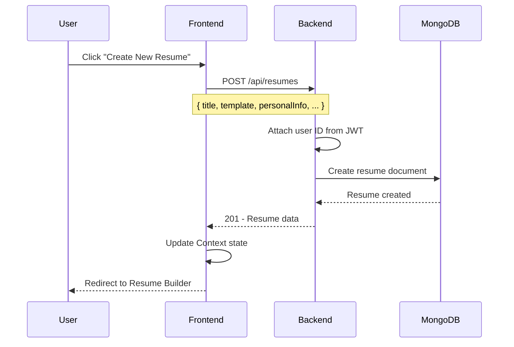
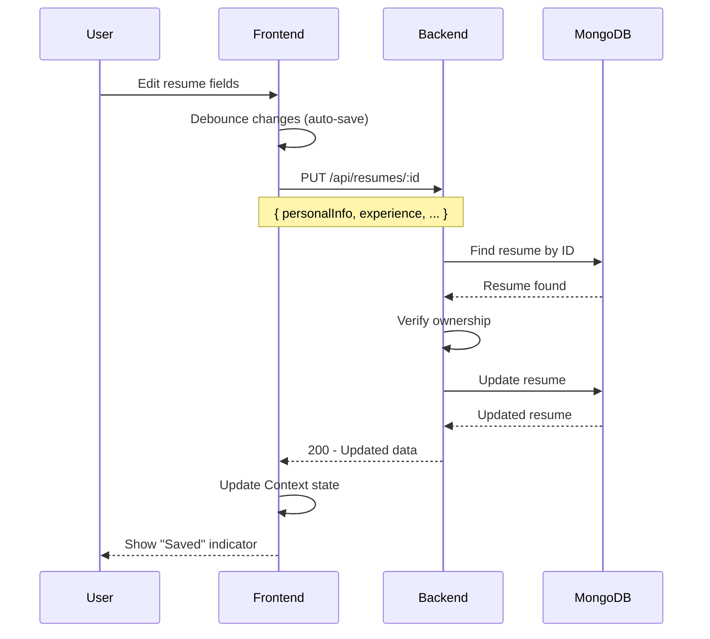
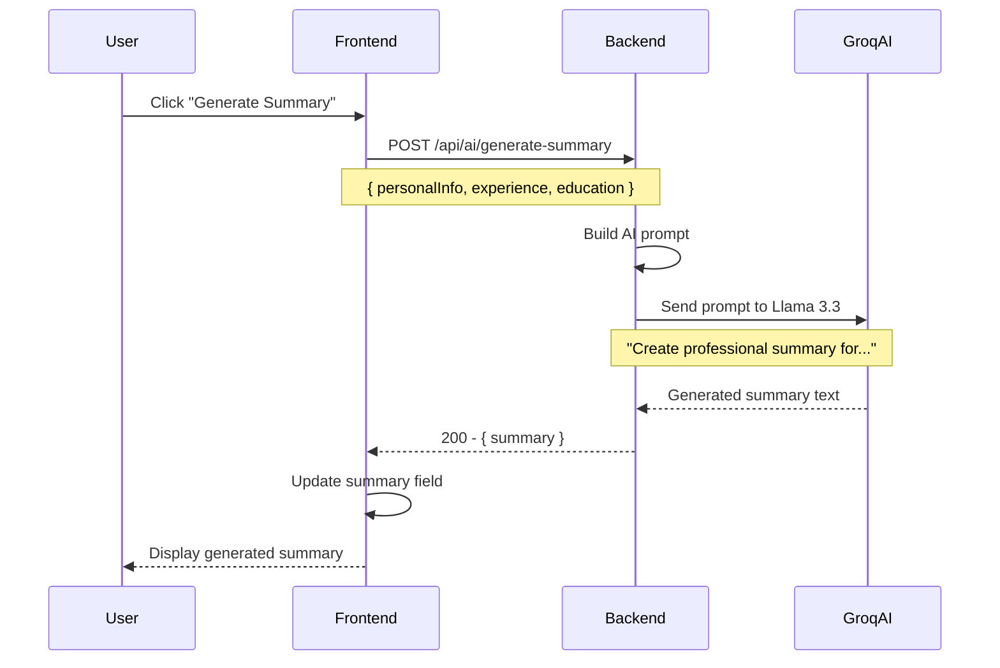
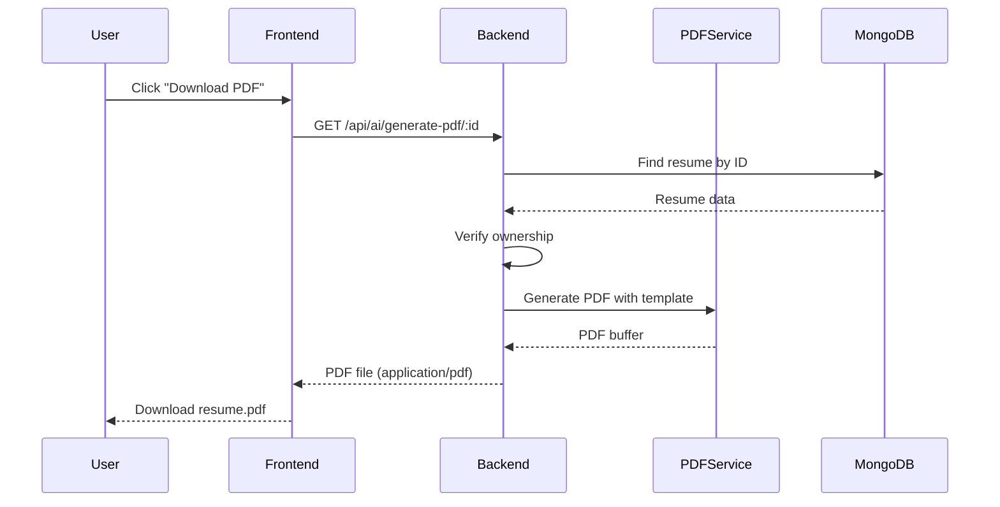
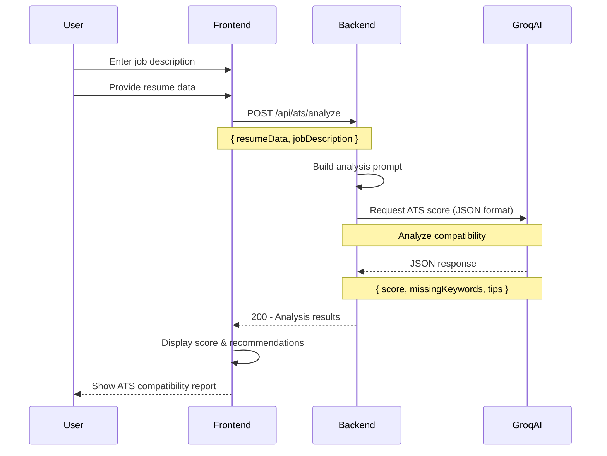
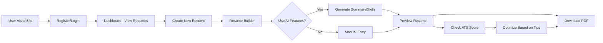

# 🔄 AI Resume Maker - Complete Project Flow

This document explains how the entire application works, including all HTTP request flows (GET, POST, PUT, DELETE).

---

## 📋 Table of Contents
1. [Architecture Overview](#architecture-overview)
2. [Authentication Flow](#authentication-flow)
3. [Resume Management Flow](#resume-management-flow)
4. [AI Features Flow](#ai-features-flow)
5. [ATS Checker Flow](#ats-checker-flow)
6. [Complete API Reference](#complete-api-reference)

---

## 🏗️ Architecture Overview



---

## 🔐 Authentication Flow

### 1️⃣ User Registration (POST)

**Flow Diagram:**


**Code Implementation:**

```javascript
// Backend: controllers/authController.js
export const register = async (req, res) => {
    const { name, email, password } = req.body;
    
    // 1. Validate input
    if (!name || !email || !password) {
        return res.status(400).json({ message: 'Missing fields' });
    }
    
    // 2. Check if user exists
    const userExists = await User.findOne({ email });
    if (userExists) {
        return res.status(400).json({ message: 'User already exists' });
    }
    
    // 3. Create user (password auto-hashed by mongoose middleware)
    const user = await User.create({ name, email, password });
    
    // 4. Generate JWT token
    const token = jwt.sign({ id: user._id }, process.env.JWT_SECRET, {
        expiresIn: '30d'
    });
    
    // 5. Set HTTP-only cookie (secure authentication)
    res.cookie('token', token, {
        httpOnly: true,
        secure: process.env.NODE_ENV === 'production',
        maxAge: 30 * 24 * 60 * 60 * 1000 // 30 days
    });
    
    // 6. Return user data
    res.status(201).json({
        success: true,
        data: { _id: user._id, name: user.name, email: user.email }
    });
};
```

---

### 2️⃣ User Login (POST)

**Request:**
```http
POST /api/auth/login
Content-Type: application/json

{
  "email": "user@example.com",
  "password": "password123"
}
```

**Response (Success):**
```json
{
  "success": true,
  "data": {
    "_id": "507f1f77bcf86cd799439011",
    "name": "John Doe",
    "email": "user@example.com",
    "role": "user"
  }
}
```

**Code Flow:**
```javascript
// 1. Find user by email (include password field)
const user = await User.findOne({ email }).select('+password');

// 2. Verify password using bcrypt
const isMatch = await user.comparePassword(password);

// 3. Generate token and set cookie
const token = generateToken(user._id);
res.cookie('token', token, { httpOnly: true });

// 4. Return user data
res.json({ success: true, data: user });
```

---

### 3️⃣ Get Current User (GET)

**Request:**
```http
GET /api/auth/me
Cookie: token=eyJhbGciOiJIUzI1NiIsInR5cCI6IkpXVCJ9...
```

**Middleware Protection:**
```javascript
// middleware/auth.js
export const protect = async (req, res, next) => {
    // 1. Extract token from cookie
    const token = req.cookies.token;
    
    if (!token) {
        return res.status(401).json({ message: 'Not authorized' });
    }
    
    // 2. Verify token
    const decoded = jwt.verify(token, process.env.JWT_SECRET);
    
    // 3. Get user from database
    req.user = await User.findById(decoded.id);
    
    // 4. Continue to next middleware/controller
    next();
};
```

---

### 4️⃣ Logout (POST)

**Request:**
```http
POST /api/auth/logout
```

**Code:**
```javascript
export const logout = async (req, res) => {
    // Clear the cookie by setting it to expire immediately
    res.cookie('token', '', {
        httpOnly: true,
        expires: new Date(0)
    });
    
    res.json({ success: true, message: 'Logged out successfully' });
};
```

---

## 📝 Resume Management Flow

### 1️⃣ Create Resume (POST)

**Flow Diagram:**


**Request:**
```http
POST /api/resumes
Authorization: Cookie (JWT token)
Content-Type: application/json

{
  "title": "Software Engineer Resume",
  "template": "modern",
  "personalInfo": {
    "fullName": "John Doe",
    "email": "john@example.com",
    "phone": "+1234567890"
  },
  "experience": [],
  "education": [],
  "skills": {
    "technical": [],
    "soft": []
  }
}
```

**Response:**
```json
{
  "success": true,
  "data": {
    "_id": "65a1b2c3d4e5f6g7h8i9j0k1",
    "user": "507f1f77bcf86cd799439011",
    "title": "Software Engineer Resume",
    "template": "modern",
    "personalInfo": { ... },
    "createdAt": "2026-02-02T05:11:41.000Z",
    "updatedAt": "2026-02-02T05:11:41.000Z"
  }
}
```

**Code:**
```javascript
// controllers/resumeController.js
export const createResume = async (req, res) => {
    // 1. Attach authenticated user ID
    req.body.user = req.user._id;
    
    // 2. Create resume in database
    const resume = await Resume.create(req.body);
    
    // 3. Return created resume
    res.status(201).json({
        success: true,
        data: resume
    });
};
```

---

### 2️⃣ Get All Resumes (GET)

**Request:**
```http
GET /api/resumes
Authorization: Cookie (JWT token)
```

**Response:**
```json
{
  "success": true,
  "count": 3,
  "data": [
    {
      "_id": "65a1b2c3d4e5f6g7h8i9j0k1",
      "title": "Software Engineer Resume",
      "template": "modern",
      "updatedAt": "2026-02-02T05:11:41.000Z"
    },
    {
      "_id": "65a1b2c3d4e5f6g7h8i9j0k2",
      "title": "Data Scientist Resume",
      "template": "classic",
      "updatedAt": "2026-02-01T03:20:15.000Z"
    }
  ]
}
```

**Code:**
```javascript
export const getResumes = async (req, res) => {
    // Find all resumes belonging to authenticated user
    // Sort by most recently updated first
    const resumes = await Resume.find({ user: req.user._id })
                                 .sort({ updatedAt: -1 });
    
    res.json({
        success: true,
        count: resumes.length,
        data: resumes
    });
};
```

---

### 3️⃣ Get Single Resume (GET)

**Request:**
```http
GET /api/resumes/65a1b2c3d4e5f6g7h8i9j0k1
Authorization: Cookie (JWT token)
```

**Code:**
```javascript
export const getResume = async (req, res) => {
    // 1. Find resume by ID
    const resume = await Resume.findById(req.params.id);
    
    if (!resume) {
        return res.status(404).json({ message: 'Resume not found' });
    }
    
    // 2. Authorization check: ensure user owns this resume
    if (resume.user.toString() !== req.user._id.toString()) {
        return res.status(401).json({ message: 'Not authorized' });
    }
    
    // 3. Return resume
    res.json({ success: true, data: resume });
};
```

---

### 4️⃣ Update Resume (PUT)

**Flow Diagram:**


**Request:**
```http
PUT /api/resumes/65a1b2c3d4e5f6g7h8i9j0k1
Authorization: Cookie (JWT token)
Content-Type: application/json

{
  "personalInfo": {
    "fullName": "John Doe",
    "email": "john.doe@example.com",
    "phone": "+1234567890",
    "location": "San Francisco, CA"
  },
  "experience": [
    {
      "position": "Senior Software Engineer",
      "company": "Tech Corp",
      "startDate": "2022-01",
      "endDate": "Present",
      "description": "Led development of microservices architecture"
    }
  ]
}
```

**Code:**
```javascript
export const updateResume = async (req, res) => {
    // 1. Find resume
    let resume = await Resume.findById(req.params.id);
    
    if (!resume) {
        return res.status(404).json({ message: 'Resume not found' });
    }
    
    // 2. Authorization check
    if (resume.user.toString() !== req.user._id.toString()) {
        return res.status(401).json({ message: 'Not authorized' });
    }
    
    // 3. Update resume (new: true returns updated document)
    resume = await Resume.findByIdAndUpdate(
        req.params.id,
        req.body,
        { new: true, runValidators: true }
    );
    
    // 4. Return updated resume
    res.json({ success: true, data: resume });
};
```

---

### 5️⃣ Delete Resume (DELETE)

**Request:**
```http
DELETE /api/resumes/65a1b2c3d4e5f6g7h8i9j0k1
Authorization: Cookie (JWT token)
```

**Response:**
```json
{
  "success": true,
  "data": {}
}
```

**Code:**
```javascript
export const deleteResume = async (req, res) => {
    // 1. Find resume
    const resume = await Resume.findById(req.params.id);
    
    if (!resume) {
        return res.status(404).json({ message: 'Resume not found' });
    }
    
    // 2. Authorization check
    if (resume.user.toString() !== req.user._id.toString()) {
        return res.status(401).json({ message: 'Not authorized' });
    }
    
    // 3. Delete resume
    await resume.deleteOne();
    
    // 4. Return success
    res.json({ success: true, data: {} });
};
```

---

## 🤖 AI Features Flow

### 1️⃣ Generate Professional Summary (POST)

**Flow Diagram:**


**Request:**
```http
POST /api/ai/generate-summary
Authorization: Cookie (JWT token)
Content-Type: application/json

{
  "personalInfo": {
    "fullName": "John Doe"
  },
  "experience": [
    {
      "position": "Software Engineer",
      "company": "Tech Corp"
    }
  ],
  "education": [
    {
      "degree": "Bachelor of Science",
      "field": "Computer Science",
      "institution": "MIT"
    }
  ]
}
```

**Response:**
```json
{
  "success": true,
  "data": {
    "summary": "Results-driven Software Engineer with proven expertise at Tech Corp. Holds a Bachelor of Science in Computer Science from MIT. Skilled in developing scalable solutions and driving technical innovation."
  }
}
```

**Code:**
```javascript
// controllers/aiController.js
export const generateSummary = async (req, res) => {
    const { personalInfo, experience, education } = req.body;
    
    // Call AI service
    const summary = await geminiService.generateSummary(
        personalInfo,
        experience,
        education
    );
    
    res.json({ success: true, data: { summary } });
};

// services/groqService.js
async generateSummary(personalInfo, experience, education) {
    // 1. Build prompt
    const prompt = `Create a professional resume summary (2-3 sentences) for:
    Name: ${personalInfo?.fullName}
    Experience: ${experience?.map(e => `${e.position} at ${e.company}`).join(', ')}
    Education: ${education?.map(e => `${e.degree} in ${e.field} from ${e.institution}`).join(', ')}
    
    Make it compelling and highlight key strengths.`;
    
    // 2. Call Groq API
    const completion = await groq.chat.completions.create({
        messages: [
            { role: "system", content: "You are a professional resume writer." },
            { role: "user", content: prompt }
        ],
        model: 'llama-3.3-70b-versatile',
        temperature: 0.7
    });
    
    // 3. Return AI response
    return completion.choices[0]?.message?.content || '';
}
```

---

### 2️⃣ Improve Job Description (POST)

**Request:**
```http
POST /api/ai/improve-description
Authorization: Cookie (JWT token)
Content-Type: application/json

{
  "description": "Worked on backend development",
  "position": "Software Engineer",
  "company": "Tech Corp"
}
```

**Response:**
```json
{
  "success": true,
  "data": {
    "improvedDescription": "• Architected and implemented scalable microservices backend infrastructure serving 1M+ users\n• Optimized database queries resulting in 40% performance improvement\n• Collaborated with cross-functional teams to deliver features 25% ahead of schedule"
  }
}
```

---

### 3️⃣ Suggest Skills (POST)

**Request:**
```http
POST /api/ai/suggest-skills
Authorization: Cookie (JWT token)
Content-Type: application/json

{
  "position": "Full Stack Developer",
  "experience": [
    {
      "position": "Software Engineer",
      "company": "Tech Corp"
    }
  ],
  "currentSkills": ["JavaScript", "React"]
}
```

**Response:**
```json
{
  "success": true,
  "data": {
    "skills": [
      "Node.js",
      "TypeScript",
      "MongoDB",
      "PostgreSQL",
      "Docker",
      "AWS",
      "REST APIs",
      "Git"
    ]
  }
}
```

---

### 4️⃣ Generate PDF (GET)

**Flow Diagram:**


**Request:**
```http
GET /api/ai/generate-pdf/65a1b2c3d4e5f6g7h8i9j0k1
Authorization: Cookie (JWT token)
```

**Response:**
```
Content-Type: application/pdf
Content-Disposition: attachment; filename="Software Engineer Resume.pdf"

[Binary PDF data]
```

**Code:**
```javascript
export const generatePDF = async (req, res) => {
    // 1. Find resume
    const resume = await Resume.findById(req.params.id);
    
    if (!resume) {
        return res.status(404).json({ message: 'Resume not found' });
    }
    
    // 2. Authorization check
    if (resume.user.toString() !== req.user._id.toString()) {
        return res.status(401).json({ message: 'Not authorized' });
    }
    
    // 3. Generate PDF using PDFKit
    const pdfBuffer = await resumeGenerator.generateResumePDF(
        resume,
        resume.template
    );
    
    // 4. Send PDF file
    res.setHeader('Content-Type', 'application/pdf');
    res.setHeader('Content-Disposition', `attachment; filename="${resume.title}.pdf"`);
    res.send(pdfBuffer);
};
```

---

## 🎯 ATS Checker Flow

### 1️⃣ Analyze Resume (POST)

**Flow Diagram:**


**Request:**
```http
POST /api/ats/analyze
Authorization: Cookie (JWT token)
Content-Type: application/json

{
  "resumeData": {
    "personalInfo": { "fullName": "John Doe" },
    "experience": [...],
    "skills": {
      "technical": ["JavaScript", "React", "Node.js"]
    }
  },
  "jobDescription": "Looking for a Senior Full Stack Developer with experience in React, Node.js, TypeScript, AWS, and Docker. Must have 5+ years of experience building scalable web applications."
}
```

**Response:**
```json
{
  "success": true,
  "data": {
    "score": 75,
    "missingKeywords": [
      "TypeScript",
      "AWS",
      "Docker",
      "scalable",
      "5+ years"
    ],
    "formattingIssues": [
      "Consider adding years of experience to each role",
      "Use more action verbs in job descriptions"
    ],
    "helpfulTips": [
      "Add TypeScript to your technical skills section",
      "Mention AWS or cloud experience in your job descriptions",
      "Include Docker or containerization experience",
      "Quantify your achievements with specific metrics",
      "Highlight experience building scalable applications"
    ]
  }
}
```

**Code:**
```javascript
// controllers/atsController.js
export const analyzeResume = async (req, res) => {
    const { resumeData, jobDescription } = req.body;
    
    if (!resumeData || !jobDescription) {
        return res.status(400).json({
            message: 'Resume data and job description are required'
        });
    }
    
    // Call AI service for ATS analysis
    const analysis = await groqService.calculateATSScore(
        resumeData,
        jobDescription
    );
    
    res.json({ success: true, data: analysis });
};

// services/groqService.js
async calculateATSScore(resumeData, jobDescription) {
    const prompt = `Analyze this resume against the job description.
    
    Resume: ${JSON.stringify(resumeData, null, 2)}
    Job Description: ${jobDescription}
    
    Return a valid JSON object with this EXACT structure:
    {
      "score": <number between 0-100>,
      "missingKeywords": ["keyword1", "keyword2", ...],
      "formattingIssues": ["issue1", "issue2", ...],
      "helpfulTips": ["tip1", "tip2", ...]
    }`;
    
    const completion = await groq.chat.completions.create({
        messages: [
            { role: "system", content: "You are an expert ATS algorithm." },
            { role: "user", content: prompt }
        ],
        model: 'llama-3.3-70b-versatile',
        temperature: 0.3, // Lower for consistent JSON
        response_format: { type: "json_object" } // Force JSON response
    });
    
    return JSON.parse(completion.choices[0]?.message?.content);
}
```

---

### 2️⃣ Optimize Uploaded Resume File (POST)

**Request:**
```http
POST /api/ai/optimize-ats-file
Authorization: Cookie (JWT token)
Content-Type: multipart/form-data

resume: [PDF file]
targetJobDescription: "Looking for a Senior Developer..."
```

**Flow:**
```javascript
// 1. Extract text from uploaded PDF
const resumeText = await pdfParser.extractText(file.buffer);

// 2. Send text to AI for optimization tips
const tips = await geminiService.optimizeForATSContent(
    resumeText,
    targetJobDescription
);

// 3. Return tips
res.json({ success: true, data: { tips } });
```

---

## 📚 Complete API Reference

### Authentication Endpoints

| Method | Endpoint | Auth | Description |
|--------|----------|------|-------------|
| POST | `/api/auth/register` | Public | Register new user |
| POST | `/api/auth/login` | Public | Login user |
| GET | `/api/auth/me` | Private | Get current user |
| POST | `/api/auth/logout` | Private | Logout user |

---

### Resume Endpoints

| Method | Endpoint | Auth | Description |
|--------|----------|------|-------------|
| GET | `/api/resumes` | Private | Get all user resumes |
| GET | `/api/resumes/:id` | Private | Get single resume |
| POST | `/api/resumes` | Private | Create new resume |
| PUT | `/api/resumes/:id` | Private | Update resume |
| DELETE | `/api/resumes/:id` | Private | Delete resume |

---

### AI Feature Endpoints

| Method | Endpoint | Auth | Description |
|--------|----------|------|-------------|
| POST | `/api/ai/generate-summary` | Private | Generate professional summary |
| POST | `/api/ai/improve-description` | Private | Improve job description |
| POST | `/api/ai/suggest-skills` | Private | Get skill suggestions |
| POST | `/api/ai/generate-project-description` | Private | Generate project description |
| POST | `/api/ai/optimize-ats` | Private | Get ATS optimization tips |
| POST | `/api/ai/optimize-ats-file` | Private | Optimize uploaded PDF resume |
| POST | `/api/ai/get-advice` | Private | Get resume section advice |
| GET | `/api/ai/generate-pdf/:id` | Private | Generate PDF for resume |

---

### ATS Checker Endpoints

| Method | Endpoint | Auth | Description |
|--------|----------|------|-------------|
| POST | `/api/ats/analyze` | Private | Analyze resume for ATS compatibility |

---

## 🔒 Security Features

### 1. JWT Authentication
- Tokens stored in **HTTP-only cookies** (prevents XSS attacks)
- 30-day expiration
- Verified on every protected route

### 2. Password Security
- Passwords hashed using **bcrypt** (10 salt rounds)
- Never stored in plain text
- Password field excluded from queries by default

### 3. Authorization Checks
- Every resume operation verifies ownership
- Users can only access their own data
- Admin routes protected with role-based access

---

## 🗄️ Database Models

### User Model
```javascript
{
  name: String,
  email: String (unique, lowercase),
  password: String (hashed, select: false),
  role: String (enum: ['user', 'admin'], default: 'user'),
  createdAt: Date,
  updatedAt: Date
}
```

### Resume Model
```javascript
{
  user: ObjectId (ref: 'User'),
  title: String,
  template: String (enum: ['modern', 'classic', 'creative', 'minimal']),
  personalInfo: {
    fullName: String,
    email: String,
    phone: String,
    location: String,
    linkedin: String,
    github: String,
    portfolio: String
  },
  summary: String,
  experience: [{
    position: String,
    company: String,
    location: String,
    startDate: String,
    endDate: String,
    description: String
  }],
  education: [{
    degree: String,
    field: String,
    institution: String,
    location: String,
    graduationDate: String,
    gpa: String
  }],
  skills: {
    technical: [String],
    soft: [String]
  },
  projects: [{
    name: String,
    description: String,
    technologies: [String],
    link: String
  }],
  certifications: [{
    name: String,
    issuer: String,
    date: String
  }],
  createdAt: Date,
  updatedAt: Date
}
```

---

## 🚀 Request/Response Flow Summary

### Typical User Journey



---

## 💡 Key Takeaways

1. **Authentication**: JWT tokens in HTTP-only cookies for security
2. **CRUD Operations**: Full Create, Read, Update, Delete for resumes
3. **AI Integration**: Groq API (Llama 3.3) powers all AI features
4. **Authorization**: Every request verifies user ownership
5. **File Handling**: Multer for PDF uploads, PDFKit for generation
6. **Error Handling**: Consistent error responses with proper status codes
7. **State Management**: React Context API on frontend
8. **Database**: MongoDB with Mongoose for schema validation

---

**Created:** 2026-02-02  
**Project:** AI Resume Maker  
**Stack:** MERN + Groq AI
